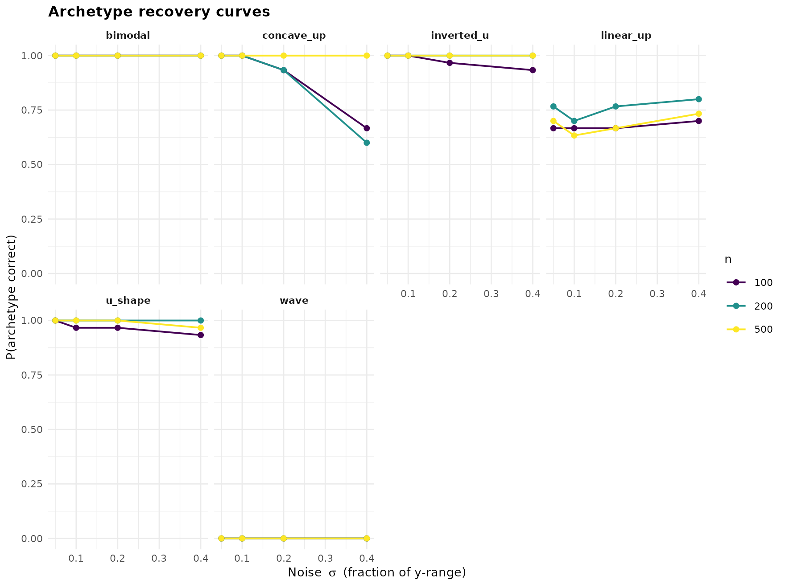
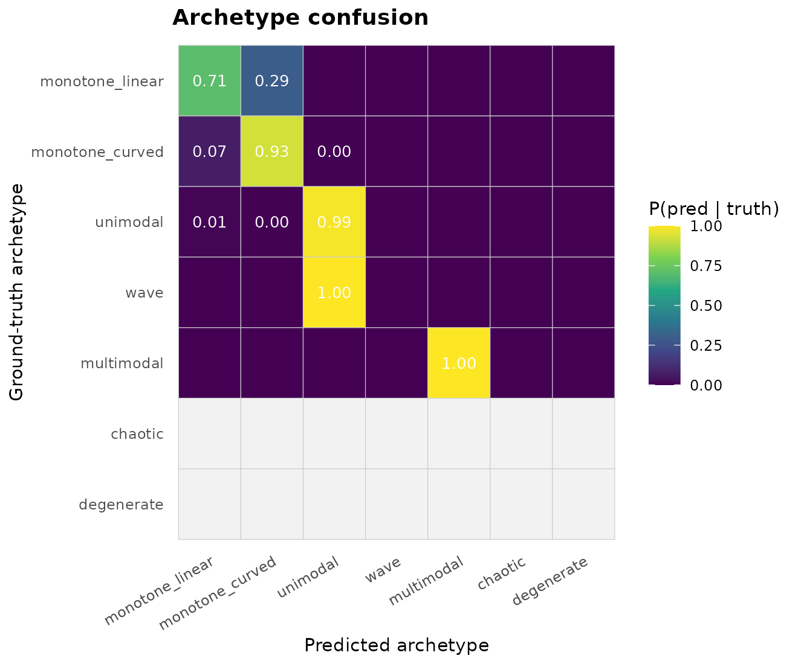
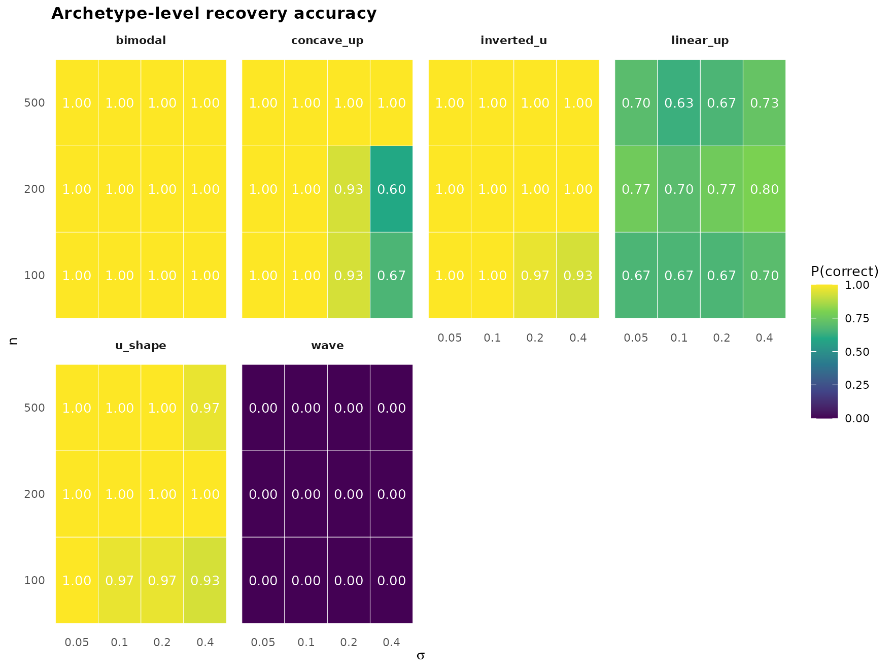

# Shape-recognition sensitivity study

[`janusplot()`](https://max578.github.io/janusplot/reference/janusplot.md)
assigns every fitted smooth to one of 24 shape categories via a
`(n_turning_points, n_inflections)` dispatch with additional
`(monotonicity_index, convexity_index)` disambiguation for the monotone
cases (see the `janusplot` vignette for the full definition of the
indices). How reliably does this classifier recover the ground-truth
shape of a noisy sample? This vignette answers the question with a
full-factorial sensitivity sweep.

## Design

For each combination of ground-truth shape, sample size `n`, and noise
level `sigma`, the sweep:

1.  Generates `n` points from the noiseless canonical curve on
    `x ∈ [0, 1]`, with `y` normalised to `[0, 1]` so that `sigma` is the
    fraction of y-range that Gaussian noise contributes — an
    SNR-comparable scale across shapes.
2.  Fits `mgcv::gam(y ~ s(x), method = "REML")`.
3.  Classifies the fit via
    [`janusplot_shape_metrics()`](https://max578.github.io/janusplot/reference/janusplot_shape_metrics.md).
4.  Records correctness at the **fine** (24-category) and **archetype**
    (7-family) levels.

The design factors are orthogonal and replicated. See
[`?janusplot_shape_sensitivity`](https://max578.github.io/janusplot/reference/janusplot_shape_sensitivity.md)
for the function surface. The 14 canonical ground-truth shapes cover
five of the seven archetypes (`chaotic` and `degenerate` have no
realistic deterministic generator).

``` r
library(janusplot)
library(ggplot2)

janusplot_shape_sensitivity_shapes()
#>  [1] "linear_up"    "linear_down"  "convex_up"    "concave_up"   "convex_down" 
#>  [6] "concave_down" "s_shape"      "u_shape"      "inverted_u"   "skewed_peak" 
#> [11] "broad_peak"   "wave"         "bimodal"      "bi_wave"
```

## Pre-registered hypotheses

The sweep’s hypotheses are pinned in `simulation/PLAN.md` (Scenario 4):

- **H1.** At `n = 500`, `sigma = 0.05`, archetype accuracy exceeds 0.90
  for every shape.
- **H2.** Fine-category accuracy exceeds 0.75 at `n = 500`,
  `sigma = 0.05` for monotone + unimodal shapes; wave and multimodal
  tolerate less noise.
- **H3.** Rippled variants require `n ≥ 200` and `sigma ≤ 0.10` to
  resolve.
- **H4.** At `sigma = 0.40`, archetype accuracy collapses below 0.50 for
  all but the simplest shapes.

## Precomputed demo

The package ships a small-footprint precomputed sweep — 6 shapes (one
per non-degenerate archetype) × 3 sample sizes × 4 noise levels × 30
replicates = 2160 fits — so you can explore the API without running the
full sweep yourself.

``` r
data("shape_sensitivity_demo")
str(shape_sensitivity_demo, vec.len = 2)
#> 'data.frame':    2160 obs. of  14 variables:
#>  $ truth             : chr  "linear_up" "concave_up" ...
#>  $ n                 : int  100 100 100 100 100 ...
#>  $ sigma             : num  0.05 0.05 0.05 0.05 0.05 ...
#>  $ seed              : int  2027 2028 2029 2030 2031 ...
#>  $ predicted         : chr  "linear_up" "concave_up" ...
#>  $ correct           : logi  TRUE TRUE TRUE ...
#>  $ archetype_truth   : chr  "monotone_linear" "monotone_curved" ...
#>  $ archetype_pred    : chr  "monotone_linear" "monotone_curved" ...
#>  $ archetype_correct : logi  TRUE TRUE TRUE ...
#>  $ monotonicity_index: num  1 1 ...
#>  $ convexity_index   : num  0 -0.847 ...
#>  $ n_turn            : int  0 0 1 1 1 ...
#>  $ n_inflect         : int  0 0 0 0 2 ...
#>  $ error             : chr  NA NA ...
```

### Recovery curves (headline figure)

``` r
janusplot_shape_sensitivity_plot(shape_sensitivity_demo,
                                 "recovery_curves")
```



Every shape is recovered near-perfectly at low noise; the informative
picture is where each shape’s curve falls off as sigma grows. The
unimodal and monotone-curved families tolerate more noise than the
multimodal ones.

### Archetype confusion

``` r
janusplot_shape_sensitivity_plot(shape_sensitivity_demo,
                                 "confusion_archetype")
```



The off-diagonals reveal the classifier’s failure modes. A `unimodal`
truth misclassified as `wave` or `multimodal` means the spline invented
extra turning points under noise.

### Archetype-level accuracy grid

``` r
janusplot_shape_sensitivity_plot(shape_sensitivity_demo,
                                 "accuracy_grid")
```



Per-shape heatmap of `P(archetype correct)` across the `(n, sigma)`
design. Reading across a row shows the noise-tolerance profile of one
sample size; reading up a column shows the sample-size sensitivity at
one noise level.

### Numerical summary

``` r
head(janusplot_shape_sensitivity_summary(shape_sensitivity_demo,
                                         level = "archetype"), 10)
#>         truth   n sigma  accuracy
#> 1     bimodal 100  0.05 1.0000000
#> 2  concave_up 100  0.05 1.0000000
#> 3  inverted_u 100  0.05 1.0000000
#> 4   linear_up 100  0.05 0.6666667
#> 5     u_shape 100  0.05 1.0000000
#> 6        wave 100  0.05 0.0000000
#> 7     bimodal 200  0.05 1.0000000
#> 8  concave_up 200  0.05 1.0000000
#> 9  inverted_u 200  0.05 1.0000000
#> 10  linear_up 200  0.05 0.7666667
```

## Running your own sweep

The demo is a starting point. For the publication-grade figure use the
full default grid (14 shapes × 4 sample sizes × 5 noise levels × 200
reps = 56 000 fits):

``` r
# Configure parallel execution (optional) — you control the plan.
future::plan(future::multisession, workers = 4L)

res <- janusplot_shape_sensitivity(parallel = TRUE)

# Save for your paper
saveRDS(res, "shape_sensitivity_full.rds")
janusplot_shape_sensitivity_plot(res, "recovery_curves")
```

### Custom shape subsets + cutoffs

Every argument is tunable. Below, we rerun only the bimodal/wave family
under stricter monotonicity thresholds to see whether tightening
`mono_strong` buys any fine-accuracy improvement for these categories.

``` r
strict <- janusplot_shape_cutoffs(mono_strong = 0.95, curv_low = 0.1)

res_strict <- janusplot_shape_sensitivity(
  shapes     = c("wave", "bimodal", "bi_wave"),
  n_grid     = c(200L, 500L),
  sigma_grid = c(0.05, 0.10, 0.20),
  n_rep      = 100L,
  cutoffs    = strict
)

janusplot_shape_sensitivity_summary(res_strict, level = "fine")
```

## References

- Pya, N., & Wood, S. N. (2015). Shape constrained additive models.
  *Statistics and Computing*, 25(3), 543–559.
- Calabrese, E. J. (2008). Hormesis: why it is important to toxicology
  and toxicologists. *Environmental Toxicology and Chemistry*, 27(7),
  1451–1474.
- Milnor, J. (1963). *Morse Theory*. Princeton University Press.
- Meyer, M. C. (2008). Inference using shape-restricted regression
  splines. *Annals of Applied Statistics*, 2(3), 1013–1033.

``` r
sessionInfo()
#> R version 4.5.3 (2026-03-11)
#> Platform: x86_64-pc-linux-gnu
#> Running under: Ubuntu 24.04.4 LTS
#> 
#> Matrix products: default
#> BLAS:   /usr/lib/x86_64-linux-gnu/openblas-pthread/libblas.so.3 
#> LAPACK: /usr/lib/x86_64-linux-gnu/openblas-pthread/libopenblasp-r0.3.26.so;  LAPACK version 3.12.0
#> 
#> locale:
#>  [1] LC_CTYPE=C.UTF-8       LC_NUMERIC=C           LC_TIME=C.UTF-8       
#>  [4] LC_COLLATE=C.UTF-8     LC_MONETARY=C.UTF-8    LC_MESSAGES=C.UTF-8   
#>  [7] LC_PAPER=C.UTF-8       LC_NAME=C              LC_ADDRESS=C          
#> [10] LC_TELEPHONE=C         LC_MEASUREMENT=C.UTF-8 LC_IDENTIFICATION=C   
#> 
#> time zone: UTC
#> tzcode source: system (glibc)
#> 
#> attached base packages:
#> [1] stats     graphics  grDevices utils     datasets  methods   base     
#> 
#> other attached packages:
#> [1] ggplot2_4.0.2        janusplot_0.0.0.9000
#> 
#> loaded via a namespace (and not attached):
#>  [1] vctrs_0.7.3        cli_3.6.6          knitr_1.51         rlang_1.2.0       
#>  [5] xfun_0.57          S7_0.2.1-1         textshaping_1.0.5  jsonlite_2.0.0    
#>  [9] labeling_0.4.3     glue_1.8.1         htmltools_0.5.9    ragg_1.5.2        
#> [13] sass_0.4.10        scales_1.4.0       rmarkdown_2.31     grid_4.5.3        
#> [17] evaluate_1.0.5     jquerylib_0.1.4    fastmap_1.2.0      yaml_2.3.12       
#> [21] lifecycle_1.0.5    compiler_4.5.3     RColorBrewer_1.1-3 fs_2.1.0          
#> [25] farver_2.1.2       systemfonts_1.3.2  digest_0.6.39      viridisLite_0.4.3 
#> [29] R6_2.6.1           bslib_0.10.0       withr_3.0.2        tools_4.5.3       
#> [33] gtable_0.3.6       pkgdown_2.2.0      cachem_1.1.0       desc_1.4.3
```
